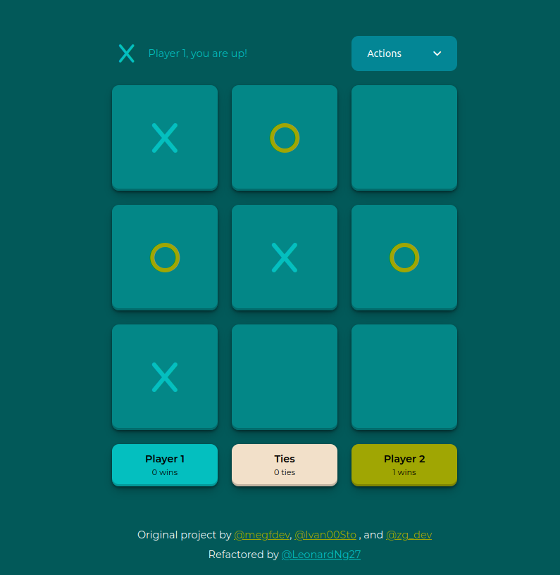
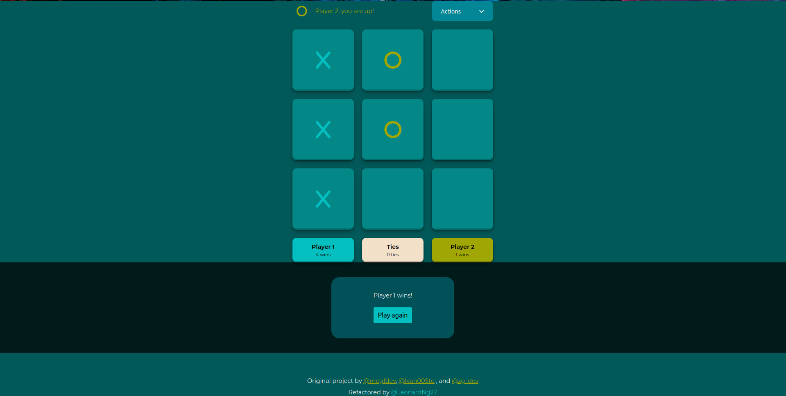

# Tic Tac Toe Refactor with Vanilla Javascript

This is my refactor of Tic Tac Toe web app using vanilla Javascript ES6 with MVC pattern.

## Table of contents

- [Overview](#overview)
  - [Screenshot](#screenshot)
  - [Links](#links)
- [My process](#my-process)
  - [Built with](#built-with)
  - [What I learned](#what-i-learned)
  - [Continued development](#continued-development)
  - [Useful resources](#useful-resources)
- [Author](#author)
- [Acknowledgments](#acknowledgments)

## Overview

### Screenshot



### Links

- Live Site URL: [Live URL](https://dungnq271.github.io/Tic-Tac-Toe-Refactor/)

## My process

### Built with

- Semantic HTML5 markup
- CSS custom properties
- Flexbox
- CSS Grid
- Mobile-first workflow
- Vanilla Javascript ES6

### What I learned

-  I discovered a [CSS box-shadow template site](https://getcssscan.com/css-box-shadow-examples) to select the box shadow effect for the squares.
- It took me some time to implement the Action Dropdown Menu. Here is the HTML layout:
```html
<div class="action-menu">
  <button class="menu-btn">
	<p>Actions</p>
	<i class="fa-solid fa-angle-down"></i>
  </button>

  <div class="action-modal hidden">
	<button class="menu-item" id="reset-btn">Reset</button>
	<button class="menu-item" id="new-round-btn">New Round</button>
  </div>
</div>
```
I struggled with positioning the action-modal div above one of the move squares at first. It turned out to be quite easy with these code (some properties are removed to show the important ones):
```css
.grid-square {
  z-index: 1;
}

.action-menu {
  position: relative;
}

.action-modal {
  position: absolute;
  z-index: 2;
}
```
- And the result display modal was worth some efforts:

HTML Layout:
```html
<div class="result-modal hidden">
  <div class="modal-body">
	<p>Player 1 wins!</p>
	<button>Play again</button>
  </div>
</div>
```

CSS Styles (only show the important ones): 
```css
.result-modal {
  display: flex;
  flex-direction: column;
  justify-content: center;
  align-items: center;
  position: fixed;
  z-index: 2;
  width: 100%;
  height: 100%;
 }
```
The `position: fixed` (or `position: absolute`) property is important as it removed the element from the normal document flow. The element will display like this otherwise:

- I learned to implement the project using MVC pattern myself. Here some the code snippets that made everything fall into place:

In [store.js](./scripts/store.js): I first used [dispatchEvent](https://developer.mozilla.org/en-US/docs/Web/API/EventTarget) api (caveat: the class implementing this have to inherit from [EventTarget](https://developer.mozilla.org/en-US/docs/Web/API/EventTarget) interface) and realized how useful it is. As stated in the documentation: "All applicable event handlers are called and return before dispatchEvent() returns."
```js
#saveState(newState) {
  localStorage.setItem(this.storageKey, JSON.stringify(newState));
  this.dispatchEvent(new Event("statechange"));
}
```

And in the *Controller* [app.js](./scripts/app.js) I had to register an event listener when calling this function. 
```js
store.addEventListener("statechange", () => {
  view.render(store.game);
});
```
Basically, every time the user interacts with the app, the *Store* will update its state then the *View* will render the latest state.
Also, the [localStorage](https://developer.mozilla.org/en-US/docs/Web/API/Window/localStorage) is super important. It helps to save game state for switching between page sessions. We can open another tab or refresh the page without losing the game state.

The code to get the latest state from storage:
```js
#getState() {
  const item = localStorage.getItem(this.storageKey);
  return item ? JSON.parse(item) : initialState;
}
```

### Continued development

- [ ] Refactor using Typescript
- [ ] Refactor using React

### Useful resources

- **Color theme**: [Travel](https://color.adobe.com/trends/Travel)

- **Font**: Google Fonts & [Font Awesome](https://fontawesome.com/)

- [Original Implementation](https://github.com/zachgoll/tic-tac-toe-subscriber-refactor) - I refered to the MVC pattern and how local storage API is used in this repo as I am learning these.

## Author

- Twitter - [@LeonardNg27](https://x.com/LeonardNg27)

## Acknowledgments

Inspired from [@zg_dev](https://x.com/zg_dev)'s [Frontend Web Development: In-Depth Project Tutorial (HTML, CSS, JavaScript, TypeScript, React)](https://youtu.be/MsnQ5uepIaE) video
